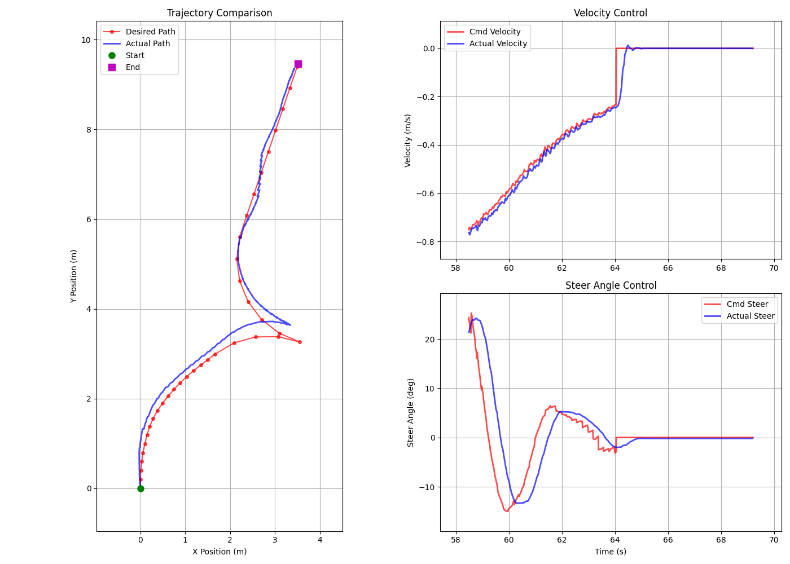

# Parking Trajectory Planning Project

This repository contains a work-in-progress implementation of a **trajectory planning system for autonomous parking**. The project focuses on generating feasible parking trajectories and integrating them with real-time vehicle control feedback.

> 🚧 The system is under active development.

## 📹 Parking Experiment Videos

Videos from real-world parking experiments can be found in the [`video`](./video) directory. The videos can also be seen in this [bilibili playlist]( https://b23.tv/1whyeV7).

## 📷 Real-time Trajectory and Control Monitoring

The following figure demonstrates the **open-loop and closed-loop trajectories**, as well as the **reference control inputs** compared to the **actual chassis feedback**.

---

Stay tuned for more updates and documentation.
